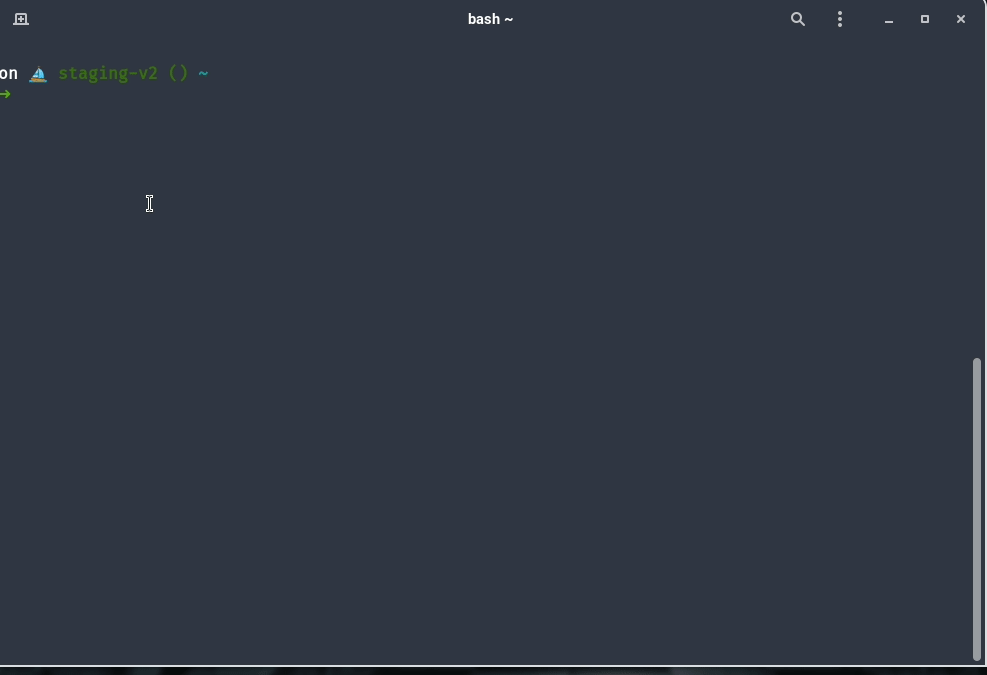

# Install gsql-proxy

## MacOS

```bash
brew install KeyValueSoftwareSystems/tools/gsql-proxy
```

## Ubuntu

```bash
curl -s https://raw.githubusercontent.com/KeyValueSoftwareSystems/gsql-proxy/master/scripts/install.sh | bash
```

# Usage

**To connect a database instance** <br />
 <br />

```bash
gsql-proxy connect --port=<port-number>
```

By default `port=5432` and is optional <br />
<br />
**To disconnect instance** <br />
 <br />

```bash
gsql-proxy disconnect
```

<br />

**For all commands** <br />

```bash
gsql-proxy --help
```

 <br />

# Prerequisites:

- [cloud_sql_proxy](https://keyvalue.atlassian.net/wiki/spaces/TD/pages/538148955/How+to+connect+CloudSQL)
- [gcloud](https://cloud.google.com/sdk/docs/install)

### Install prerequisites in single click (WIP)

```bash
curl -s https://raw.githubusercontent.com/KeyValueSoftwareSystems/gsql-proxy/master/scripts/install_prerequisites.sh | bash
```
